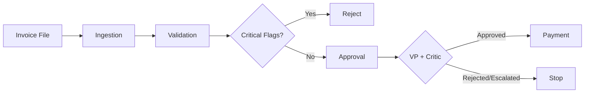

# Galatiq Invoice Processing System

Built a multi-agent pipeline that automates Acme Corp's invoice processing workflow. Takes messy invoices in any format (PDF, TXT, JSON, CSV, XML), extracts the data, validates against inventory, runs VP-level approval with a reflection loop, and processes payment.

## What it does

The system processes 20 test invoice files end-to-end. Some highlights from the batch run:

- **INV-1003** (Fraudster LLC, $100K) — caught 5 flags: untrusted vendor, zero-stock FakeItem, urgency language. Auto-rejected.
- **INV-1009** — missing vendor, negative quantity, no due date. All caught, auto-rejected.
- **INV-1013** (Atlas Industrial, $22.5K) — VP agent initially approved it. Critic agent caught the risk and flipped it to escalated. This is the reflection loop actually working, not just for show.
- **INV-1008** — SuperGizmo and MegaSprocket flagged as unknown items since they don't exist in the inventory DB.

8 approved, 12 rejected/escalated across the full test set.

## How it works

Four agents wired together in LangGraph:



**Ingestion** — Detects file format, routes to the right parser. JSON/CSV/XML get deterministic parsers. TXT and PDF get sent to gpt-4o-mini for extraction. The idea is simple: `json.loads()` doesn't hallucinate vendor names, so why waste an API call on structured data?

**Validation** — No LLM here, just logic. Checks each line item against SQLite (stock levels, item existence), verifies vendor trust status, checks pricing against expected ranges with tolerance bands, scans for fraud keywords like "urgent" and "wire transfer." Every issue gets a flag with a severity level.

**Approval** — Three paths. Under $10K with no flags? Auto-approve. Critical validation failures? Auto-reject. Everything else goes to the LLM for VP-level reasoning, then a second LLM call critiques the first decision. The critic specifically checks if the VP weighed flags correctly and whether there are fraud patterns being missed.

**Payment** — Mock API call with transaction ID generation. Only fires if approved.

## Why I made certain choices

**LangGraph over CrewAI/AutoGen** — financial workflows need deterministic routing. I want "if critical flags exist, reject" to be a code branch, not something an LLM decides. LangGraph's conditional edges give me that control while still using LLMs for reasoning within each node.

**Deterministic parsing first, LLM as fallback** — About 60% of the test invoices are structured formats that don't need an LLM at all. Running everything through GPT would cost more, take longer, and introduce unnecessary failure points.

**Extended DB schema** — The assessment gives a minimal inventory table. I added vendor trust levels and expected pricing with tolerance bands. That's how the system catches the WidgetA rush order at $300/unit (within 20% tolerance of the expected $250, so it passes) while a $400 charge would get flagged.

## Setup

```bash
git clone https://github.com/JadynWor/galatiq-invoice-agents.git
cd galatiq-invoice-agents
python -m venv venv
source venv/bin/activate
pip install -r requirements.txt

cp .env.example .env
# add your OpenAI API key to .env

python setup_db.py
```

## Running it

```bash
# Single invoice
python main.py --invoice_path=data/invoices/invoice_1004.json

# All invoices
python main.py --invoice_dir=data/invoices/

# Streamlit dashboard
python -m streamlit run ui/app.py
```

## Stack

Python 3.12, LangGraph, OpenAI (gpt-4o-mini), Pydantic, SQLite, pdfplumber, Rich, Streamlit

The OpenAI client is configured so swapping to Grok is a one-line base_url change.
